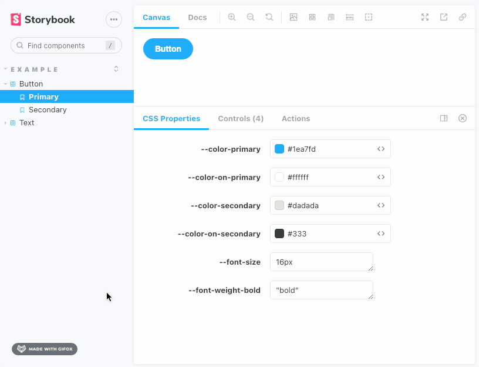
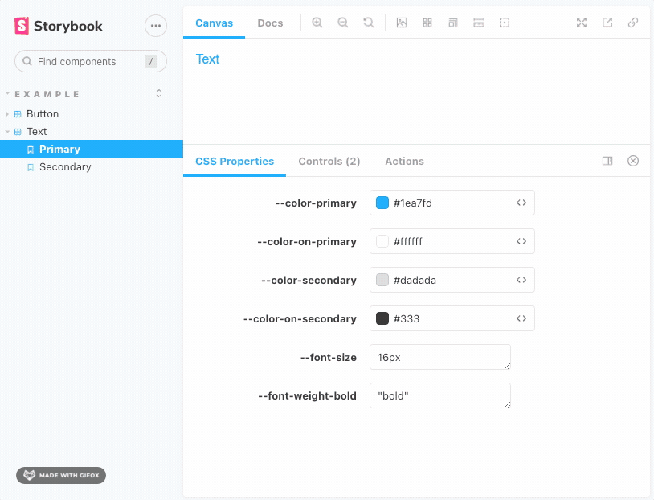

# Storybook Addon CSS Custom Properties

This addon allows you to customize the CSS Properties of you project.

It will grab all the CSS Custom Properties from our project automatically, cast it between `color` and `text` based on the [CSS.support](https://developer.mozilla.org/en-US/docs/Web/API/CSS/supports) browser's native method response and display in a custom panel where you can easily modify it.

| Button | Text |
| --- | --- |
|  |  |


## Instalation

Run it in your terminal:

```bash
npm install -D @bissolli/storybook-css-properties
```

Then, add following content to [.storybook/main.js](https://storybook.js.org/docs/react/configure/overview#configure-your-storybook-project):

```js
module.exports = {
  addons: ['@bissolli/storybook-css-properties'],
};
```

You should now be able to see the new CSS Properties panel.
