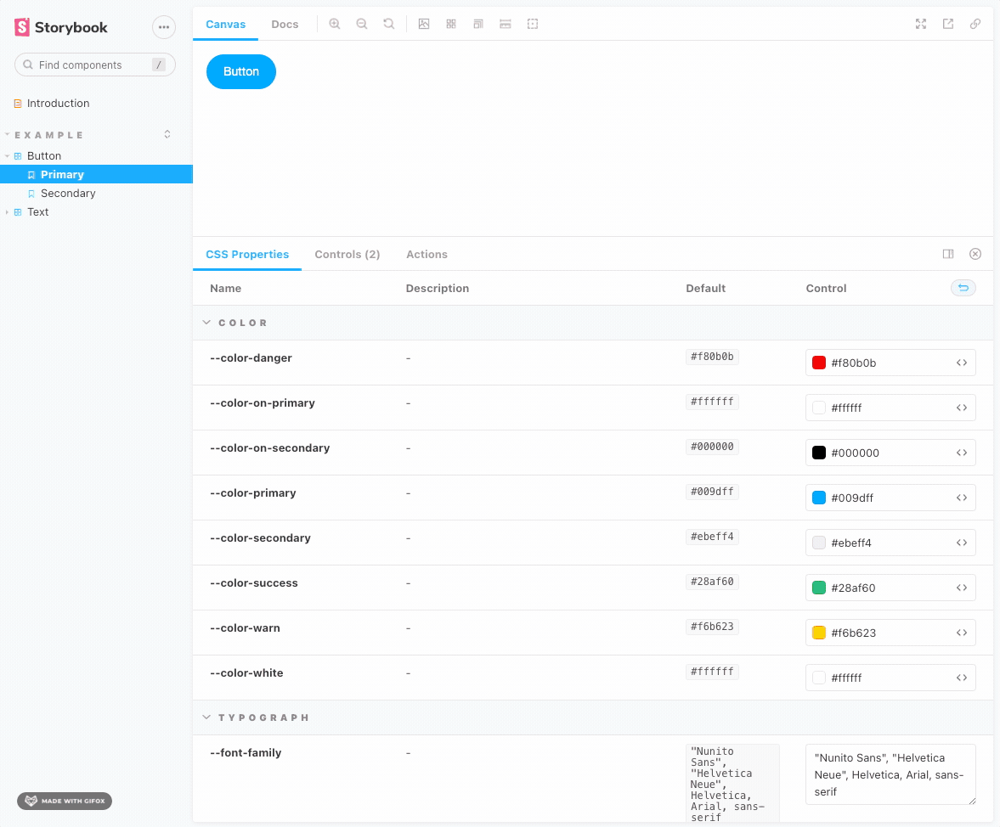

# Storybook Addon CSS Custom Properties

This addon allows you to customize the CSS Properties of you project.

**A Vue3 friendly addon**: you won't face any [problem](https://github.com/johnsoncodehk/volar/discussions/592) with `@types/react` by using this addon =)

It will grab all the CSS Custom Properties from our project automatically, cast it between `color` and `text` based on the [CSS.support](https://developer.mozilla.org/en-US/docs/Web/API/CSS/supports) browser's native method response and display in a custom panel where you can easily modify it.




## Instalation

Run it in your terminal:

```bash
npm install -D @bissolli/storybook-css-properties
```

Then, add following content to [.storybook/main.js](https://storybook.js.org/docs/react/configure/overview#configure-your-storybook-project):

```js
module.exports = {
  addons: ['@bissolli/storybook-css-properties'],
};
```

Done, the addons will identify all the available CSS Custom Properties on your components and make it available for edition in the CSS Properties panel.

## Customization

The addon will do all job for you, but if for some reason you need to customize something yourself, we have a few tricks available for you.

Through the `preview.{ts|js}` file, you can simpily play with the addon parameters to get the desired output.

**Example**
```js
export const parameters: Parameters = {
  cssCustomProperties: {
    // list here all the props you would like to customize manually
    // this will deepmerge and override any setup that was automatically done
    // by the addon
    props: {
      // prop name
      '--font-size': {
        // description to be shown in the table
        description: 'This property is the only one coming from the `Text` component',
        // if you want to group items, use this props
        // this has a higher weight than the following `matchCategory`
        category: 'Button properties'
      },
    },
    // props listed here won't be visible in the panel to be customized
    hiddenProps: [
      '--color-white',
    ],
    // to make your life easier when grouping props
    // you can use regex to match props name and add under a section in the table
    // the key is the name of the section
    matchCategory: {
      color: /color/,
      typograph: /font/,
      space: /(space|padding|margin|line-height)/
    }
  }
};
```

The example above will output the following Panel


